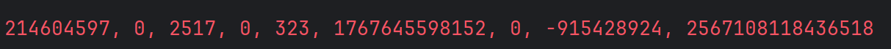
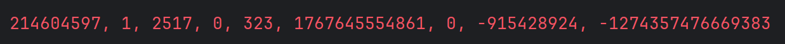
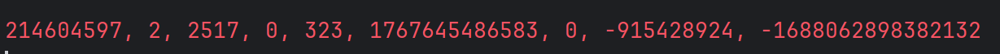
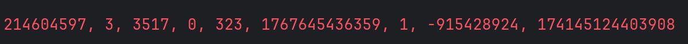
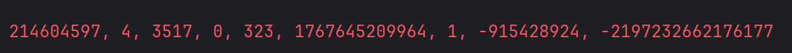

<div align="center">

# ᗧ··· 👻 Ex3: The Cyclic Survivor

### Autonomous Pac-Man Agent for Torus Topology Maps

<p>


</p>

</div>

---

## 📖 Overview

This project implements a smart, deterministic `PacManAlgo` designed to solve the Ex3 Pac-Man game.
The core philosophy of this algorithm is **"Safety First"**. Instead of greedily chasing points, the agent prioritizes survival by analyzing the map's topology and avoiding "death traps" (dead ends or small enclosed areas).

The algorithm is specifically optimized for a **Cyclic World (Torus Topology)**, where the map edges wrap around, treating borders as potential escape routes.

---

## 🧠 Key Strategies & Mechanics

### 🔄 1. Cyclic Awareness (Torus Topology)
Unlike standard pathfinding, this algorithm treats the board as a continuous surface.
* **Movement:** Moving left from `x=0` wraps the agent to `x=width-1`.
* **Logic:** The distance is calculated using modular arithmetic to find the true shortest path:
```java
// Example of cyclic distance logic
int dx = Math.abs(x1 - x2);
dx = Math.min(dx, width - dx); // Takes the wrap-around shortcut if shorter
```

### 🧱 2. "Virtual Wall" Defense

The algorithm treats ghosts as dynamic obstacles with a danger radius.

* Any tile within a **radius of 1** from a ghost is treated as a **WALL**.
* Pathfinding (BFS) and safety checks cannot traverse these "virtual walls," preventing accidental collisions.

### 🔍 3. The "80-Tile Rule" (Flood Fill)

This is the algorithm's main safety net against dead ends.
Before making **any** move, the agent runs a **Cyclic Flood Fill** simulation:

1. It simulates moving to the next tile.
2. It counts how many reachable tiles exist from that point (blocking ghosts).
3. **Threshold:** If the reachable area is smaller than `MIN_SAFE_AREA` (80 tiles), it's flagged as a **Trap**.
4. The agent **refuses** to enter traps, even if they contain food.

---

## 🚦 Decision Making Process

The agent (`move` method) operates on a strict hierarchy:

| Priority | Mode | Description |
| --- | --- | --- |
| 1️⃣ | **Panic Mode** | Triggered when a ghost is within distance `4`. The agent ignores food and runs to maximize open space and distance from ghosts. |
| 2️⃣ | **Secure Feeding** | If safe, searches for food using BFS. Validates that the path to food does not lead into a closed trap/corridor. |
| 3️⃣ | **Survival Roaming** | If no safe food is found, the agent wanders towards the most open area to wait for the map to change. |

---

## 🛠️ Technical Highlights

* **Algorithm:** Breadth-First Search (BFS) for pathfinding.
* **Validation:** Recursive Flood Fill for area analysis.
* **Optimization:** Multi-Source BFS for creating ghost "Heat Maps".
* **Topology:** Fully supports Cyclic/Torus wrapping.

---
🎮 Game Engine & GUI Improvements
Designed and implemented in Ex3Game class.

Beyond the algorithm, this project includes a rich graphical interface using StdDraw:

Dynamic Sprites: Pac-Man rotates visually based on movement direction.

Custom Assets: Replaced standard shapes with high-quality images (png) for Ghosts and Pac-Man.

Sound System: Multi-threaded audio engine supporting background music loops and sound effects for Win and Loss conditions.

GUI Logic: Real-time score tracking and "Game Over" / "You Win" overlay screens.
---
🏆 Performance & Results
Below are the execution results for the 5 main scenarios (Levels 0-4), demonstrating the algorithm's consistency.

Scenario 0:

Scenario 1:

Scenario 2:

Scenario 3:

Scenario 4:


<div align="center">
<b>Submitted by Eliav Damti</b>
</div>
